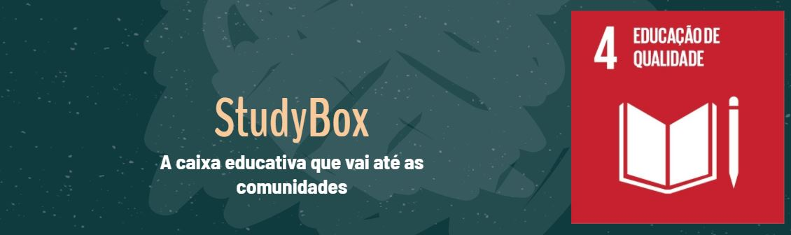
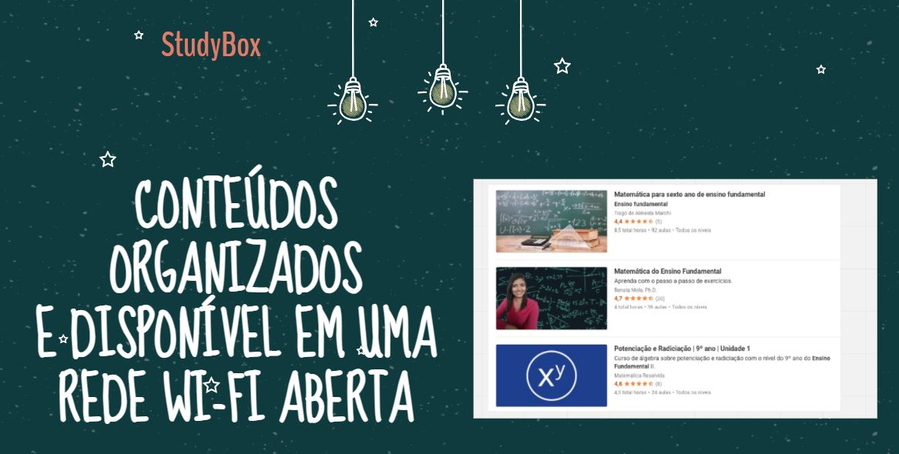
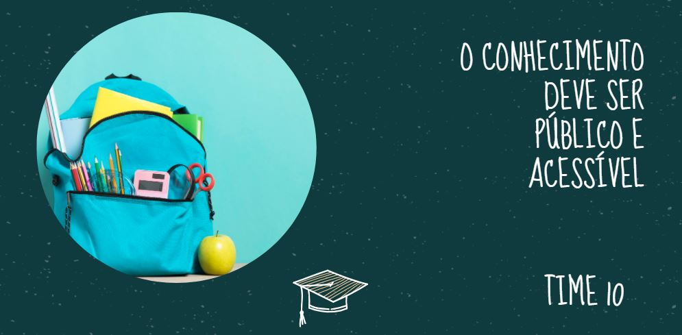

# 
StudyBox

<i>A caixa educativa que vai até as comunidades!</i>

## 💡 Proposta
<i>Conteúdos organizados e disponíveis em uma rede Wi-fi aberta e móvel, que pode ser levada às comunidades carentes e remotas.</i>
  
### 🤝 Parcerias:
- **Equipamento**: Temwifi.com.br
- Prefeituras, Entidades, Operadoras
- Aplicativos de ensino

### Outras vantagens
- Distribuição de conteúdos curados.
- Divulgação de informações da comunidade.
- A "escola" é móvel (pode ir de barco ou moto)

### Público Alvo
- Secretarias de Educação
- Projetos sociais
- Cursinhos comunitários

*Este projeto auxiliará famílias de baixa renda com pouco ou nenhum acesso à internet.*

## ⚙ Tecnologias

* [Create-React-App](https://github.com/facebook/create-react-app)
* [Material-UI](https://github.com/mui-org/material-ui)
* [React-Router](https://github.com/ReactTraining/react-router)
  

 ## 💪 Time
  - Daniel Leite (Designer)  [LinkedIn](https://www.linkedin.com/in/daniel-leite-aa17b843/) . [Behance](https://www.behance.net/danielrodrigo)
  - Léo Morais (Business) [LinkedIn](https://www.linkedin.com/in/leohmoraes/)
  - Everton Ferreira (Dev) [LinkedIn](https://www.linkedin.com/in/evertonferreira96/)
  - Ana Beatriz Rodrigues (Marketing) [Linkedin](https://www.linkedin.com/in/ana-beatriz-rodrigues-5517961a8/)
  - Vinicius Passos (Dev) [LinkedIn](https://www.linkedin.com/in/vtpa/) . [GitHub](https://github.com/vtpa)

